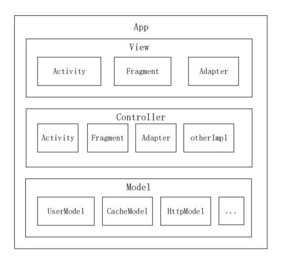

## MVC ##

这个MVC比较随意，所以不要拿这里的设计思路去和书本上进行比较，可以理解为这是一个恰好名字叫MVC的其他设计。

整体app架构图如下：

> 图比较糙，将就一下

这个图和MVC的铁三角比起来相去甚远。所以不要认为它是MVC,它只不过恰好也叫MVC而已。

## 关于V和C ##

其实很多时候，V和C是同一个角色，在Android开发中，很多界面逻辑本身就比较简单（比如目前没有任何广告设计，没有用户使用导航的启动页），强行将其拆分为controller和view反而效果一般，而稍微复杂一些的界面，当数据的处理放到Model层去以后，逻辑也依然能够hold住，所以，大部分时候，VC都由Activity和Fragment，Adapter这三者来完成。少量情况下我们需要拆分出来，所以看上去三者的关系不是M-C-V，更像是M-CV。

## Model ##

model是app中重要的设计

1. Model角色拥有和Application一样的生命周期，可以理解为处于UI线程中的service，Model的存在让跨页面的数据发送有了简单有效的解决方案。所有的Model集合整体能够承担EventBus的部分职责。
2. 同时Model还用于持有app生命周期中生效的数据，比如全局的用户信息数据，app设置数据，缓存操作工具，Http请求执行环境等。
3. 前后台的数据交互处理在Model层进行，CV所做的事情尽量简单。
4. Model的app生命周期内单例的设计让开发者能在任何地方拿到Model的实例。

## 结论 ##

一切为了简单化，没有复杂的接口设计，没有太多分层处理。但是很有效。并且它也并不是那么简单，很多东西并没有在图上体现出来。了解后面的文档，你可能会有不同与眼下的想法。